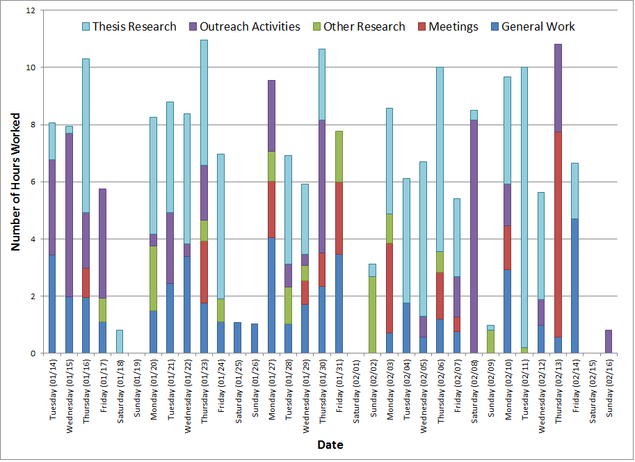

```{r, echo=FALSE}
knitr::opts_chunk$set(tidy = FALSE, cache=TRUE, fig.height=6, echo=FALSE)
```


# What I'm going to present
- Intro - why did I do this
- Data collection
- Analysis
- Future directions - other questions?


# Motivation
- Entering grad school - how much time do I need to invest?
- Anecdotal: it will take all of your time
- Lots of claims, but no data

# Questions
- How much time do I invest in Grad School?
    - How much time do I spend on campus?
    - How much time am I working on grad school stuff? 
    - What percent of time that I am on campus am I actually getting work done?


# One data point


\tiny http://rddenton.blogspot.com/2014/02/who-works-80-hours-week-in-academia.html

# Who am I?
Grad student in Plant Biology

- Genomics (computational work), and local adaptation (field / greenhouse / lab work)
- Advisor says I'm making good progress
- How do I compare to other Grad students?
    - I'm probably not very representative... but then what is a "normal" grad student


# Data Collection

## Tools

- Android App: Gleeo
    - Time doing work
- Google Spreadsheet
    - Time I'm on campus


# How do I categorize my time?

How many categories?

- Tracked everything in a spreadsheet for a week
- Partition the tasks into categories, with the least amount going into a "misc" bin
- Still iterating, implement another scheme starting fall semester


 
# Analysis
```{r, echo= FALSE, message= FALSE}
library(dplyr)
library(ggplot2)
library(lubridate)
# go get data that I prepared in report1.Rmd, so I can load stuff already processed.

setwd("~/Dropbox/proj/qgs/")
load(file = "rep1_clock.df.Rdata")
load(file = "rep1_gleeo.df.Rdata")
load(file= "rep1_timeday.df.Rdata")
load("rep1_trackedtime.df.Rdata")
trackedtime_MF <- trackedtime %>% filter(day != "Sat", day != "Sun")
trackedtime_MF_week <- trackedtime_MF %>% group_by(week) %>% summarize(weekprodtime = sum(prodtime))
timeweek.df <- timeday.df %>% group_by(week) %>% summarize(aweff= mean(efficiency), totwtrackedCampusInterval = sum(timeday.df$campusprodtime))
```

## Packages
- `lubridate` to work with dates, times, and intervals
- `dplyr` to work with dataframes
- `ggplot2` to make all the graphics

# `lubridate` is pretty handy
```{r, echo=TRUE, eval=FALSE}
# getting the week number from the date
clock.df$week <- week(clock.df$date)
# Using intervals, dividing the seconds in the
  # interval by the exact seconds in an hour
clock.df$campustime <- interval(
         ymd_hms(paste(clock.df$date,
                       clock.df$in_time)),
         ymd_hms(paste(clock.df$date,
                       clock.df$out_time))
         ) / ehours(1)
```


# `dplyr` is neat
```{r, echo=TRUE}
clock.df %>% group_by(day) %>% 
                summarize(mean(campustime))
```


# Campus Time

- Time that I am at my office / on campus each day, Monday - Friday


# How long am I at campus?
```{r, echo=FALSE, fig.height=6}
ggplot(clock.df, aes(x=campustime)) + 
    geom_histogram(aes(y=..density..),
                   binwidth=.25, color="black", fill="white") + 
    geom_density(alpha=.3, fill="black") + 
    ggtitle("Amount of time I spend at campus per day")
summary(clock.df$campustime)[c(1,4,6)]
```


# Grouped by weekday?

```{r, echo=FALSE, fig.height=6}
ggplot(clock.df, aes(x=day, y=campustime)) + geom_violin() + 
    geom_errorbar(stat = "hline", yintercept = "mean", width=0.3, aes(ymax= ..y.. , ymin= ..y.., ))
```


# Time per week?
```{r, echo=FALSE, fig.height=6}
weekclock <- clock.df %>% group_by(week) %>% summarize(weekcampus = sum(campustime))

ggplot(weekclock, aes(x=weekcampus)) + 
    geom_histogram(aes(y=..density..),
                   binwidth=1, color="black", fill="white") + 
    geom_density(alpha=.3, fill="black")
summary(weekclock$weekcampus)[c(1,4,6)]
```

# Productive Time per day

$$
ProductiveTime = Total Tracked Time - Personal Tracked Time
$$ 

# Distribution of Productive Time per day
```{r}
ggplot(trackedtime_MF, aes(x=prodtime)) +
    geom_histogram(aes(y=..density..),
                   binwidth=.25, color="black", fill="white") + 
    geom_density(alpha=.3, fill="black")
summary(trackedtime_MF$prodtime)[c(1,4,6)]
```

# Distribution of Productive Time Each Day
```{r}
ggplot(trackedtime, aes(x=day, y=prodtime)) + 
    geom_violin() + 
    geom_errorbar(stat = "hline", yintercept = "mean", width=0.3, aes(ymax= ..y.. , ymin= ..y.., ))
```


# How does Productive Time vary over time?
```{r}
ggplot(trackedtime_MF, aes(x=date, y=prodtime, group=week, color=week)  ) +
    geom_line(size=2) + geom_point(color="black") + theme_bw() +
    theme(axis.text.x = element_text(angle=90, hjust= 1))
```

# Weekly Productive Time
```{r}
ggplot(trackedtime_MF_week, aes(x=week, y=weekprodtime, group=1)) + geom_line()
summary(trackedtime_MF_week$weekprodtime)[c(1,4,6)]
```


# Efficiency
- When I am at campus, how much time of that am I actually working?
$$
Efficiency = \frac{Total Tracked Time - Personal Tracked Time}{Time At Campus}
$$

# `lubridate` is really handy here
My solution isn't elegant... 

- make the interval that I am at campus, one per day
- for each tracked task, make an instant
- for loop to go by each campus interval and find which instants are within that interval, store in df
- populate a new df with only those instants in the interval
    - for loop, and rbind


# What is the distribution of my efficiency?
```{r}
ggplot(timeday.df, aes(x=efficiency)) +
    geom_histogram(aes(y=..density..),
                   binwidth=.02, color="black", fill="white") + 
    geom_density(alpha=.3, fill="black")
summary(timeday.df$efficiency)[c(1,4,6)]
```


# How does my efficiency vary over time?
```{r}
ggplot(timeday.df, aes(x=date, y=efficiency, group=week, color=week )) +
    geom_line(size=2) + geom_point(color="black") + theme_bw() +
    theme(axis.text.x = element_text(angle=90, hjust= 1))
```


# How does my efficiency vary by week?
```{r}
ggplot(timeweek.df, aes(x=week, y=totwtrackedCampusInterval, group=1)) + geom_line()
```


# In Summary

## How much time do I invest in Grad School?
- I spend a mean of **`r summary(clock.df$campustime)[4]` hrs per day**, and **`r summary(weekclock$weekcampus)[4]` hrs per week** at campus
- I work a mean of **`r summary(trackedtime_MF$prodtime)[4]` hours per day**, and **`r summary(trackedtime_MF_week$weekprodtime)[4]` hours per week**

## How productive am I?
- My mean productivity is **`r summary(timeday.df$efficiency)[4]`** hrs worked / hr at campus

# Project Data
- I haven't used my categorized tracked time data yet
- next goal: make a graph of time invested in projects as a function of date 


# Self Improvement?
- I've answered the questions I started with, but how can I use this to improve my studies?
- Act of tracking improving my focus? 
- Guilt of bad data?

Advisor says:

>"...issues with Brownian Motion in accomplishing your projects..."


# Future work
- Cal Newport and Deep Thought --- is there a way to track this?
- How much do grad students read?
    - I can kind of answer this already
    
# More Data and Passive tracking
- Moves app to potentially track my campus time, also time at gym
- Using Rescue Time to track computer usage 
    - especially quick email usage --- often not tracked
- Pull in weather data?
- What things can affect my productivity, and is it easy to collect these data?

# This is on GitHub
https://github.com/dnedveck/qgs

- `./qgs/TCRUG`
    - This presentation
- `./*_GleeoExport.csv`
    - Time tracking data
- `./*_clocktime.csv`
    - Campus time data

 
# Any Questions?
- nedveck@gmail.com
- [dnedveck.com](dnedveck.com)
- https://github.com/dnedveck/qgs


# x 

# Productive time at campus given time at campus
```{r}
ggplot(timeday.df, aes(x=campustime, y=campusprodtime)) + geom_point()
```


# Efficiency given campus time
```{r}
ggplot(timeday.df, aes(x=campustime, y=efficiency)) + geom_point()
```


